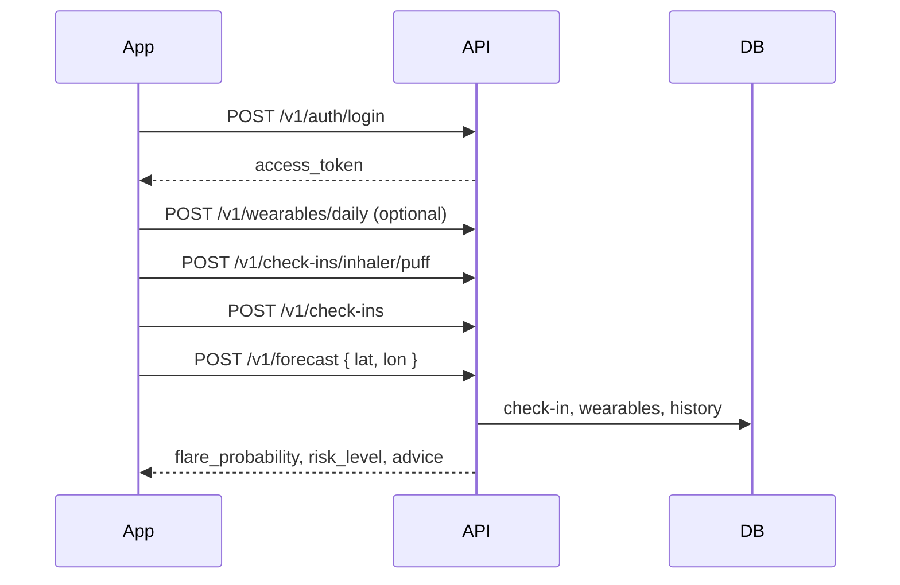

# Mirror Lake — API Reference

**Version:** 1.0  
**Base URL:** `http://127.0.0.1:8000` (local)  
**Audience:** Frontend and mobile clients  
**Last updated:** 2026-07-03

Interactive docs: [`/docs`](http://127.0.0.1:8000/docs) (Swagger UI)

---

## Overview

Mirror Lake predicts **tomorrow's asthma flare risk** and returns **personalized advice**. Product flows use the **`/v1`** routes below. All user data (check-ins, wearables, forecasts) is stored in PostgreSQL and scoped to the authenticated user.

### Implementation status

| Area | Status |
|------|--------|
| Auth & user profile | **Shipped** |
| Daily check-ins & inhaler logging | **Shipped** |
| Wearable daily sync | **Shipped** |
| Environment data (`/v1/env/daily`) | **Shipped** |
| Google Calendar (OAuth + structured events → LLM) | **Shipped** |
| Forecast + bundled advice | **Shipped** |
| Advice regeneration (`/v1/advice`) | **Shipped** |
| Chat Q&A (`/v1/chat`) | **Shipped** (same Copilot graph; does not persist Home advice) |
| Legacy `/predict/*` routes | **Shipped** (research / fallback; product uses `/v1/forecast`) |
| **Edge AI** (per-user on-device model) | **Not implemented** — future phase |
| Frontend integration | **Partial** — auth, setup, home/stats forecast cards, calendar OAuth + month view, check-ins, chat wired; inhaler button + wearables UI still open |

### Typical daily flow

1. User logs in → store JWT.
2. Optional: sync yesterday's Health data → `POST /v1/wearables/daily`.
3. User taps rescue inhaler and/or logs symptoms → `POST /v1/check-ins/inhaler/puff` and/or `POST /v1/check-ins`.
4. Home screen → `POST /v1/forecast` with GPS → risk + advice.
5. Optional: refresh advice only → `POST /v1/advice`.



---

## Authentication

All `/v1/*` routes except `/v1/auth/*` and `GET /v1/env/daily` require a JWT (Bearer token).

### Register

`POST /v1/auth/register` → **201**

**Request body**

| Field | Type | Required | Notes |
|-------|------|----------|-------|
| `email` | string | yes | Unique, lowercased server-side |
| `password` | string | yes | Min 8 characters |
| `name` | string | no | |
| `date_of_birth` | string (`YYYY-MM-DD`) | no | |
| `emergency_contact` | string | no | |
| `preferred_reminder` | string | no | e.g. `"08:00"` |
| `contact_method` | string | no | e.g. `"Email"` |
| `preferred_environment` | string | no | |
| `care_goal` | string | no | |
| `accessibility_needs` | string | no | |
| `trigger_preferences` | string[] | no | e.g. `["Pollen", "Exercise"]` |
| `trigger_sensitivities` | object | no | Keys → float 0–1, e.g. `{ "pollen": 0.8 }` |

**Response**

```json
{
  "access_token": "<jwt>",
  "token_type": "bearer"
}
```

**Errors:** `409 EMAIL_EXISTS`

---

### Login

`POST /v1/auth/login` → **200**

```json
{ "email": "user@example.com", "password": "..." }
```

**Response:** same as register.

**Errors:** `401 INVALID_CREDENTIALS`

---

### Refresh token

`POST /v1/auth/refresh` → **200**

```json
{ "access_token": "<current or expired jwt>" }
```

Returns a new `access_token` if the subject is still valid.

---

### Using the token

```http
Authorization: Bearer <access_token>
```

---

## User profile

### Get profile

`GET /v1/users/me` → **200**

```json
{
  "id": "uuid",
  "email": "user@example.com",
  "name": "Elena M.",
  "profile_image_url": "https://res.cloudinary.com/demo/image/upload/v1/profile.jpg",
  "date_of_birth": "1998-03-15",
  "emergency_contact": "Alex M. — 555-0100",
  "preferred_reminder": "08:00",
  "contact_method": "Email",
  "preferred_environment": "Low-pollen mornings",
  "care_goal": "Keep symptoms stable during exercise",
  "accessibility_needs": "Large text and clear contrast",
  "trigger_preferences": ["Pollen", "Exercise", "Cold air"],
  "trigger_sensitivities": { "pollen": 0.8, "exercise": 0.7 }
}
```

| Field | Notes |
|-------|--------|
| `profile_image_url` | Optional HTTPS URL (e.g. Cloudinary `secure_url`). Frontend uploads to Cloudinary; backend only stores the URL. |

### Update profile

`PATCH /v1/users/me` → **200**

Send only fields to change (same shape as register profile fields). Returns updated profile.

Example — save a Cloudinary avatar URL:

```json
{
  "profile_image_url": "https://res.cloudinary.com/xxxxx/image/upload/v123/profile.jpg"
}
```

No separate profile-image endpoint is required; use `PATCH /v1/users/me`.

---

## Check-ins

One row per user per calendar day. Inhaler counts live on the same row.

### Upsert symptoms

`POST /v1/check-ins` → **201**

| Field | Type | Default | Description |
|-------|------|---------|-------------|
| `date` | string (`YYYY-MM-DD`) | today | |
| `daily_day_symp` | boolean | `false` | Daytime symptoms |
| `daily_night_symp` | boolean | `false` | Night symptoms |
| `daily_limit_activity` | boolean | `false` | Activity limited by asthma |
| `notes` | string | null | Free text |
| `triggers` | string[] | null | e.g. `["Pollen", "Exercise"]` |
| `calendar_event` | string | null | Upcoming activity for advice context, e.g. `"Outdoor soccer tomorrow"` |

**Does not set inhaler puffs** — use inhaler endpoints below.

**Response:** check-in object (see [Check-in object](#check-in-object)), plus:

| Field | Type | Description |
|-------|------|-------------|
| `forecast_refreshed` | boolean | `true` when today's or yesterday's symptoms changed an existing ML forecast |
| `forecast` | object \| omitted | Compact updated prediction (`risk_level`, `flare_probability`, `contributing_factors`, dates) when refreshed |

When a forecast already exists for that check-in day (`Forecast.date`), the API re-runs the classifier (not the LLM). Advice is cleared and backfilled on the next `POST /v1/forecasts/today` / Home load. Older days than yesterday do not refresh a prediction.

---

### List check-ins

`GET /v1/check-ins?from=YYYY-MM-DD&to=YYYY-MM-DD` → **200**

```json
{ "items": [ /* check-in objects */ ] }
```

---

### Today's check-in

`GET /v1/check-ins/today` → **200**

Returns today's row, creating an empty one if needed.

---

### Check-in object

```json
{
  "id": "uuid",
  "date": "2026-07-03",
  "daily_day_symp": false,
  "daily_night_symp": true,
  "daily_limit_activity": false,
  "symptoms_logged": true,
  "puffs_today": 2,
  "symptom_burden_score": 2,
  "notes": null,
  "triggers": ["Pollen"],
  "calendar_event": "Morning run tomorrow",
  "is_flare_up": 0,
  "is_flare_up_threshold": false
}
```

| Field | Meaning |
|-------|---------|
| `symptoms_logged` | User submitted `POST /v1/check-ins` for this day |
| `symptom_burden_score` | Non-clinical 0–5 trend score: one point per symptom flag, plus 0 points for 0 puffs, 1 for 1–2 puffs, or 2 for 3+ puffs |
| `is_flare_up_threshold` | `puffs_today >= 3` |
| `is_flare_up` | Model label: threshold **or** all three symptom flags true |

---

## Rescue inhaler

Two endpoints update the same daily `puffs_today` total.

### Quick log (+1 puff)

`POST /v1/check-ins/inhaler/puff` → **200**

**Request** (optional body):

```json
{
  "date": "2026-07-03",
  "recorded_at": "2026-07-03T14:32:00Z"
}
```

**Response**

```json
{
  "date": "2026-07-03",
  "puffs_today": 2,
  "event_id": "uuid",
  "is_flare_up_threshold": false,
  "message": "Logged 1 puff. Today's total: 2.",
  "forecast_refreshed": false
}
```

Same `forecast_refreshed` / `forecast` fields as symptom upsert when today/yesterday already has a stored prediction.
---

### Set daily total manually

`PUT /v1/check-ins/inhaler` → **200**

```json
{ "date": "2026-07-03", "puffs_today": 4 }
```

| Field | Constraints |
|-------|-------------|
| `puffs_today` | integer, `0`–`50` |

**Response**

```json
{
  "date": "2026-07-03",
  "puffs_today": 4,
  "source": "manual",
  "is_flare_up_threshold": true
}
```

---

## Wearables (Health app sync)

Client reads HealthKit / Health Connect on device, aggregates one day, and POSTs to the server.

`POST /v1/wearables/daily` → **201**

| Field | Type | Description |
|-------|------|-------------|
| `date` | string (`YYYY-MM-DD`) | **Required** — usually yesterday |
| `sleep_minutes` | integer | Optional |
| `total_steps` | integer | Optional |
| `sedentary_minutes` | integer | Optional |
| `running_minutes` | integer | Optional |
| `avg_hr` | number | Optional average heart rate |

```json
{
  "date": "2026-07-02",
  "sleep_minutes": 390,
  "total_steps": 6200,
  "sedentary_minutes": 480,
  "running_minutes": 15,
  "avg_hr": 71
}
```

Upserts by `(user, date)`. Omitted fields are stored as `null`. Forecast uses **yesterday's** row as classifier lag features.

There is no `GET` wearables endpoint in v1; keep local display state or re-sync as needed.

---

## Environment data

`GET /v1/env/daily` → **200**  
**Auth:** not required

| Query | Required | Description |
|-------|----------|-------------|
| `lat` | yes | WGS84 latitude, −90…90 |
| `lon` | yes | WGS84 longitude, −180…180 |
| `date` | no | `YYYY-MM-DD`, default today |
| `provider` | no | `openweather` (production) or `openmeteo` (dev). Default from server `ENV_PROVIDER`. |

**Response**

```json
{
  "date": "2026-07-03",
  "lat": 42.36,
  "lon": -71.06,
  "provider": "openweather",
  "features": {
    "temperature": 24.1,
    "temperature_min": 18.0,
    "temperature_max": 28.0,
    "pressure": 1012.0,
    "humidity": 55.0,
    "wind_speed": 3.0,
    "wind_deg": 180.0,
    "aqi": 2,
    "co": 200.0,
    "no": 1.0,
    "no2": 10.0,
    "o3": 40.0,
    "so2": 2.0,
    "pm2_5": 12.0,
    "pm10": 18.0,
    "nh3": 1.0,
    "grass_pollen": "Low",
    "tree_pollen": "Moderate",
    "weed_pollen": "Low"
  },
  "missing": [],
  "cached": false
}
```

**`features`** always includes 19 keys (see [ENV_API_DESIGN.md](./ENV_API_DESIGN.md)). Pollen values are `Low` | `Moderate` | `High` | `Very High`. **`missing`** lists columns the provider could not supply.

**Errors:** `400` invalid provider; `502` provider failure

---

## Forecast (Home screen)

Primary product endpoint: tomorrow's risk + LLM advice.

`POST /v1/forecast` → **200**

### Prerequisites

Today's check-in must be **complete**:

- `POST /v1/check-ins` (symptoms logged), **or**
- at least one `POST /v1/check-ins/inhaler/puff`

Otherwise → `400 CHECK_IN_REQUIRED`.

### Request

```json
{
  "lat": 42.36,
  "lon": -71.06,
  "date": "2026-07-03",
  "llm_provider": "gemini",
  "advice_type": "daily"
}
```

| Field | Required | Description |
|-------|----------|-------------|
| `lat`, `lon` | yes | Device GPS |
| `date` | no | Anchor date (default today); forecast is for **anchor + 1 day** |
| `llm_provider` | no | `"claude"` or `"gemini"` (default from server config) |
| `advice_type` | no | Patient advice mode (default `"daily"`). Allowed: `"daily"`, `"emergency"`, `"action_plan"`, `"air_quality"`, `"wildfire"`, `"adherence"`, `"exercise"` |

### Response

```json
{
  "date": "2026-07-03",
  "forecast_for": "2026-07-04",
  "prediction_mode": "classifier",
  "flare_probability": 0.68,
  "predicted_flare_tomorrow": true,
  "risk_level": "Medium",
  "contributing_factors": [
    "High tree pollen",
    "Night symptoms today",
    "Rescue inhaler used twice"
  ],
  "top_features": ["is_flare_up", "humidity", "pm2_5"],
  "cold_start": false,
  "missing_features": [],
  "warnings": [],
  "advice": {
    "summary": "...",
    "sections": [
      { "title": "Before tomorrow's activity", "body": "..." },
      { "title": "During activity", "body": "..." }
    ],
    "disclaimer": "This information is for educational purposes only...",
    "llm_provider": "gemini",
    "knowledge_sources_used": ["local_knowledge", "user_history"]
  },
  "data_quality": {
    "unavailable_context": ["wearables", "calendar"],
    "missing_fields": [],
    "imputed_fields": [],
    "warnings": []
  }
}
```

| Field | Description |
|-------|-------------|
| `risk_level` | `"Low"` \| `"Medium"` \| `"High"` |
| `contributing_factors` | Human-readable list for UI chips |
| `advice` | Bundled Copilot advice for Home, or `null` when all LLM providers fail (ML forecast is still returned) |
| `warnings` | Classifier warnings plus advice/outage notes (e.g. advice temporarily unavailable) |
| `data_quality` | `{ unavailable_context, missing_fields, imputed_fields, warnings }` — e.g. `wearables` / `calendar` when absent |

**Errors**

| HTTP | Code | When |
|------|------|------|
| 400 | `CHECK_IN_REQUIRED` | No check-in / puff today |
| 401 | `UNAUTHORIZED` | Missing or invalid JWT |
| 502 | `ENV_PROVIDER_ERROR` | Weather/pollen fetch failed |
| 503 | `CLASSIFIER_UNAVAILABLE` | Model artifact missing |

LLM advice failure does **not** fail the forecast: HTTP stays **200**, `advice` is `null`, and a message is added to `warnings` / `data_quality.warnings`.

Result is persisted in PostgreSQL for advice regeneration.

---

## Advice regeneration

Re-run the LLM advice pipeline **without** re-running the classifier. Requires a prior forecast for the same date.

**Check-in is optional.** Advice can still use the cached risk score, stored environment (AQI, pollen, etc.), history, and medical knowledge — e.g. recommend a mask when air quality is poor even if today's symptoms were never logged. Missing check-in is reported in `data_quality.unavailable_context` and `warnings`; the API does **not** invent “no symptoms.”

`POST /v1/advice` → **200**

```json
{
  "date": "2026-07-03",
  "llm_provider": "gemini",
  "advice_type": "air_quality"
}
```

| Field | Required | Description |
|-------|----------|-------------|
| `date` | no | Anchor date (default today) |
| `llm_provider` | no | `"claude"` or `"gemini"` (default from server config) |
| `advice_type` | no | Same patient modes as forecast (default `"daily"`) |

**Response**

```json
{
  "date": "2026-07-03",
  "forecast_for": "2026-07-04",
  "risk_level": "Medium",
  "flare_probability": 0.68,
  "contributing_factors": ["Elevated air quality index"],
  "advice": { /* same shape as forecast.advice; may be null if LLM providers fail */ },
  "warnings": [
    "Generated without today's symptom check-in; advice is based on the cached forecast, environment, and medical knowledge."
  ],
  "data_quality": {
    "unavailable_context": ["check_in", "calendar"],
    "missing_fields": [],
    "imputed_fields": [],
    "warnings": ["..."]
  }
}
```

**Errors:** `404 FORECAST_NOT_FOUND` if `POST /v1/forecast` was not run for that date. Advice LLM outages return **200** with `advice: null` and a warning (stored ML forecast is unchanged).

Manual `calendar_event` on a check-in is passed into the Copilot calendar node (`source: "manual"`).

Structured events from Google Calendar, `POST /v1/calendar/manual-events`, or `calendar_events` on forecast are loaded into LangGraph via `StructuredCalendarProvider` for **tomorrow** (the forecast target day), including title, time, location, and description.

---

## Chat (Copilot Q&A)

Answer a user **message** using the same LangGraph Copilot as daily advice (forecast, calendar, env, episode memory, medical knowledge). Requires a prior forecast for the date.

**Does not overwrite** the Home-card `Forecast.advice` row (`persist=false`). Durable personalization comes from medical/episode memory (check-ins, forecasts, calendar), not chat logs. Future conversation memory, streaming, or citations should extend `/v1/chat` only — not `/v1/advice`.

`POST /v1/chat` → **200**

```json
{
  "message": "Should I run outside with this pollen?",
  "date": "2026-07-03",
  "llm_provider": "gemini"
}
```

| Field | Required | Description |
|-------|----------|-------------|
| `message` | yes | User question or statement (1–1000 chars) |
| `date` | no | Forecast anchor date (default today) |
| `llm_provider` | no | `"claude"` or `"gemini"` |

**Response:** same shape as `POST /v1/advice` (`advice`, `warnings`, `risk_level`, `data_quality`, …). The UI typically shows `advice.summary`.

**Errors:**

- `404 FORECAST_NOT_FOUND` — no cached forecast; complete a check-in and generate a prediction first
- `400` — empty/whitespace `message`

LLM outages return **200** with `advice: null` and a warning (same as advice regen).

---

## Health check

`GET /health` → **200**  
**Auth:** not required

```json
{
  "status": "ok",
  "classifier_loaded": true,
  "any_model_available": true,
  "database": {
    "status": "ok",
    "connected": true,
    "url_host": "localhost:5432/mirror_lake"
  },
  "training": {
    "missing_data_strategy": "xgb_native_nan",
    "peakflow": "not_used",
    "nullable_api_fields": [
      "sleep_minutes_lag",
      "sedentary_minutes_lag",
      "running_minutes_lag",
      "total_steps_lag",
      "avg_hr_lag",
      "temp_diff_tomorrow",
      "is_flare_up"
    ]
  }
}
```

`status` is `"degraded"` when the database is unreachable. Auth and forecast routes need `database.connected: true`.

---

## Legacy prediction routes

For research and cold-start fallback. **Product UI should use `POST /v1/forecast`.**

| Method | Path | Description |
|--------|------|-------------|
| `POST` | `/predict/classifier` | Full XGBoost classifier; send env + optional wearable lags |
| `POST` | `/predict` | GINA rules for new users with minimal history |

Both support optional `?include_advice=true` (legacy Claude interpreter). See `/docs` for request schemas.

**Important:** Send JSON `null` for unknown sensor fields — do **not** use `0` for missing data.

---

## Client integration notes

### Calendar

Backend can connect a user's Google Calendar (read-only OAuth) and automatically fetch **tomorrow's** events when running `POST /v1/forecast`.

| Step | Endpoint |
|------|----------|
| Status | `GET /v1/calendar/status` |
| Start OAuth | `GET /v1/calendar/connect` → open `auth_url` |
| Google redirect | `GET /v1/calendar/callback` (stores refresh token) |
| Preview events | `GET /v1/calendar/events?date=YYYY-MM-DD` **or** `?from=&to=` (inclusive range, max 62 days; preferred for month grids) |
| Disconnect | `DELETE /v1/calendar/disconnect` |

Setup details: [CALENDAR.md](./CALENDAR.md).

Dev without Google: `POST /v1/calendar/manual-events`, or pass `calendar_events` on forecast. Legacy string still works on check-in:

```json
{ "calendar_event": "Outdoor soccer tomorrow" }
```

### Location

Send `lat` / `lon` from device GPS on forecast (and env if needed). The server fetches weather and pollen for that point.

### Error format

```json
{
  "detail": "Human-readable message",
  "code": "CHECK_IN_REQUIRED"
}
```

Validation errors (`400`) may include an `errors` array (Pydantic).

| Code | HTTP | Meaning |
|------|------|---------|
| `VALIDATION_ERROR` | 400 | Invalid request body or query |
| `CHECK_IN_REQUIRED` | 400 | Forecast without today's check-in |
| `UNAUTHORIZED` | 401 | Missing or bad JWT |
| `INVALID_CREDENTIALS` | 401 | Login failed |
| `USER_NOT_FOUND` | 404 | Token subject not in DB |
| `FORECAST_NOT_FOUND` | 404 | No forecast for advice regeneration |
| `EMAIL_EXISTS` | 409 | Register with existing email |
| `ENV_PROVIDER_ERROR` | 502 | Environment API failure |
| `CLASSIFIER_UNAVAILABLE` | 503 | Model file missing |

LLM provider outages on `/v1/forecast`, `/v1/advice`, and `/v1/chat` do not use a dedicated error code: the response stays **200** with `advice: null` and a warning string.

---

## Endpoint index

| Method | Path | Auth | Description |
|--------|------|------|-------------|
| `GET` | `/health` | No | Service health |
| `GET` | `/v1/env/daily` | No | Environment features for lat/lon |
| `POST` | `/v1/auth/register` | No | Create account |
| `POST` | `/v1/auth/login` | No | Sign in |
| `POST` | `/v1/auth/refresh` | No | Refresh JWT |
| `GET` | `/v1/users/me` | Yes | Get profile |
| `PATCH` | `/v1/users/me` | Yes | Update profile |
| `POST` | `/v1/check-ins` | Yes | Upsert symptoms |
| `GET` | `/v1/check-ins` | Yes | List history |
| `GET` | `/v1/check-ins/today` | Yes | Today's check-in |
| `POST` | `/v1/check-ins/inhaler/puff` | Yes | Log +1 puff |
| `PUT` | `/v1/check-ins/inhaler` | Yes | Set puff total |
| `POST` | `/v1/wearables/daily` | Yes | Sync Health aggregates |
| `GET` | `/v1/calendar/status` | Yes | Google Calendar connection status |
| `GET` | `/v1/calendar/connect` | Yes | Start Google OAuth |
| `GET` | `/v1/calendar/events` | Yes | Preview events for a day (`date`) or range (`from`/`to`) |
| `POST` | `/v1/calendar/manual-events` | Yes | Dev: store structured events |
| `DELETE` | `/v1/calendar/disconnect` | Yes | Disconnect Google Calendar |
| `POST` | `/v1/forecast` | Yes | Tomorrow risk + advice (+ auto calendar) |
| `GET` | `/v1/forecasts` | Yes | Forecast history |
| `POST` | `/v1/forecasts/today` | Yes | Get-or-create `{ today, tomorrow }` for home/stats (runs ML/advice if missing) |
| `GET` | `/v1/forecasts/today` | Yes | Read-only peek at stored card predictions (no ML/LLM) |
| `POST` | `/v1/advice` | Yes | Regenerate daily advice (persists to forecast) |
| `POST` | `/v1/chat` | Yes | Copilot Q&A over cached forecast (does not overwrite Home advice) |
| `POST` | `/predict/classifier` | No | Legacy classifier |
| `POST` | `/predict` | No | Legacy GINA cold start |

---

## Roadmap (not in v1)

| Feature | Notes |
|---------|-------|
| **Edge AI** | Per-user on-device model training and routing |
| `GET /v1/wearables/daily` | History read-back |
| Peak flow (PEF) | Out of scope for classifier |

---

## Related documentation

- [ENV_API_DESIGN.md](./ENV_API_DESIGN.md) — environment column definitions and providers
- [CALENDAR.md](./CALENDAR.md) — Google Calendar OAuth setup
- [README.md](../README.md) — local setup, Docker, tests
